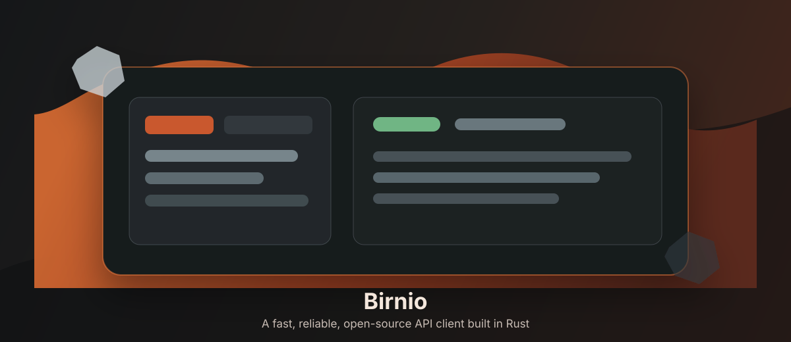

<p align="center">
  
</p>

# Birnio

Birnio is an early-stage open-source API client written in Rust. The goal is to build a fast, reliable, local-first alternative to tools like Bruno and Insomnia, with a native GTK/libadwaita desktop experience.

The project is intentionally modular from the start: domain types, HTTP execution, storage, importers, and UI live in separate crates so each part can evolve without turning the app into one large frontend binary.

## Status

Birnio is currently a foundation skeleton. The workspace compiles, has a minimal GTK/libadwaita shell, and includes first-pass core, HTTP, storage, and import modules. The UI is not yet a usable API client.

## Workspace

```text
crates/
  birnio-core       Domain types and shared data model
  birnio-http       HTTP request execution through reqwest
  birnio-storage    SQLite persistence through sqlx
  birnio-import     Import adapters for Bruno, Insomnia, and Postman
  birnio-ui-gtk     GTK/libadwaita desktop application shell
```

## Architecture

`birnio-core` is the stable center of the project. It defines collections, requests, responses, environments, variables, and authentication without depending on UI, storage, or HTTP libraries.

`birnio-http` receives `birnio-core` requests, builds `reqwest` requests, executes them, and converts the result back into `birnio-core` responses.

`birnio-storage` owns SQLite migrations and repository functions. It converts between database records and core domain types.

`birnio-import` converts external formats into core collections. Postman has a minimal initial importer; Bruno and Insomnia are intentionally stubbed until their formats are modeled.

`birnio-ui-gtk` is the native desktop shell using GTK4, libadwaita, and Relm4-ready dependencies.

## Requirements

- Rust stable
- GTK4 development libraries
- libadwaita development libraries
- SQLite development libraries

On GNOME-focused Linux distributions, GTK4 and libadwaita are usually available through the system package manager. macOS can work for development too, but Linux/GNOME is the primary design target.

## Developer Commands

The common commands are wrapped in the `Makefile`:

```sh
make help
make fmt
make check
make test
make check-ui
make run-ui
```

Equivalent Cargo commands:

```sh
cargo fmt --all --check
cargo check --workspace
cargo test --workspace
cargo run -p birnio-ui-gtk
```

## CLI Direction

A CLI crate is worth adding, but not as the next foundation dependency.

The right shape is a future `birnio-cli` crate that depends on `birnio-core`, `birnio-http`, `birnio-storage`, and `birnio-import`, but not on the GTK UI. It should be used for automation and development workflows such as:

- importing collections
- validating collection files
- executing a request by id or file path
- exporting collections
- running smoke tests in CI

The desktop app should remain the main product surface. The CLI should reuse the same core engine instead of becoming a separate client.

## Roadmap

- Build the first real GTK/libadwaita request editor flow.
- Persist collections and environments through `birnio-storage`.
- Execute requests from the UI through `birnio-http`.
- Expand import support for Bruno, Insomnia, and Postman.
- Add a small `birnio-cli` once the core request execution and storage contracts settle.

## License

The workspace is configured for `MIT OR Apache-2.0`. License files still need to be added before publishing.
