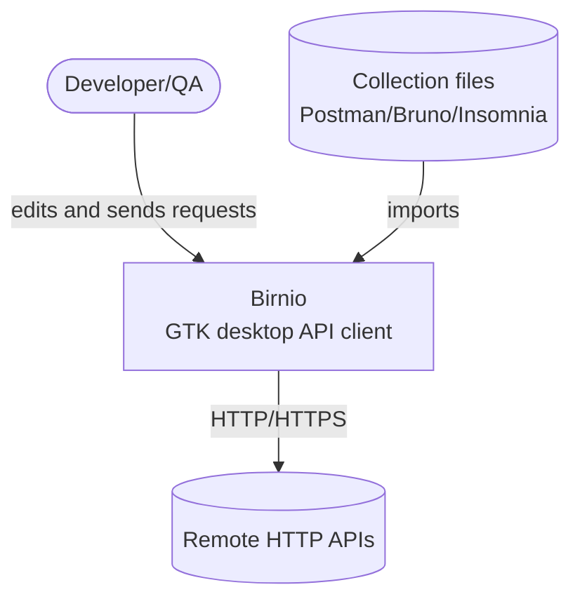
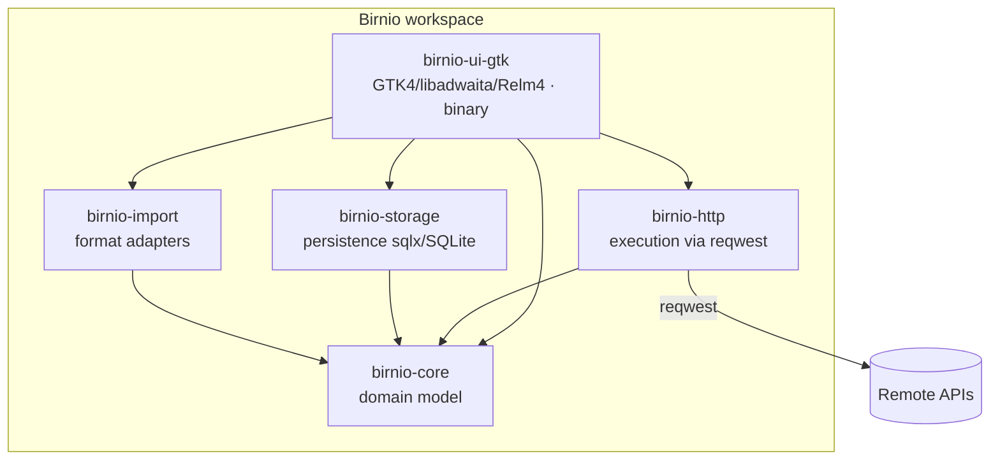
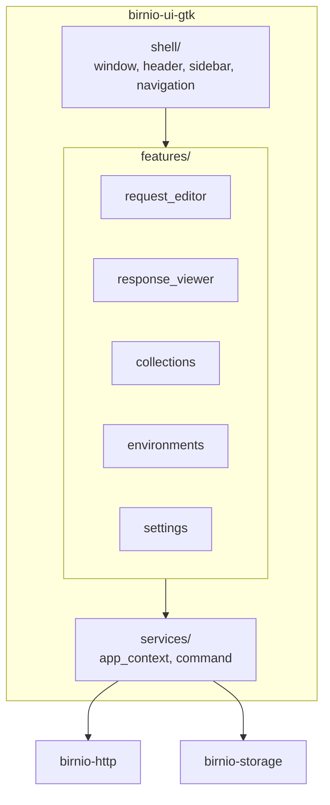
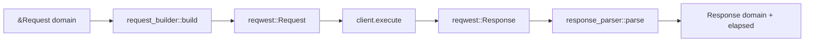

<!-- generated by sdd-docs · derived from the crate structure @ main · 2026-06-12 -->

# C4 Model

Birnio's architecture in C4 levels. Birnio is a local-first desktop app; the only
external system is the remote API the user queries.

## Level 1 — Context

## Level 2 — Containers (crates)

`birnio-core` is the stable center with no internal dependencies. `http`,
`storage`, and `import` depend only on `core`. `ui-gtk` orchestrates them all.

## Level 3 — Components of birnio-ui-gtk

Each feature follows the `component / message / state / mod` quartet (TEA style).
Business logic stays in the library crates; `services/` is the bridge.

## Level 4 — Code (critical component: HttpExecutor)

The most critical flow is request execution in `birnio-http`:

The `HttpExecutor` trait uses RPIT `+ Send` (not `async fn`) to keep the future
`Send` — see the comment in `executor.rs` and [MADR.md](MADR.md) ADR-0005.
