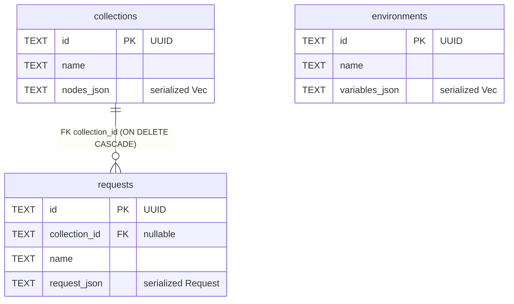

<!-- generated by sdd-docs · derived from crates/birnio-storage + birnio-core @ main · 2026-06-12 -->

# Data Schema

Birnio's data model. The **current** persistence is SQLite (via sqlx), but the
roadmap (M2/M3) migrates to grep-friendly **HAR workspace files** — see
[MADR.md](MADR.md) ADR-0006. This document describes the current state and flags
the transition.

## Current state — SQLite

Source: `crates/birnio-storage/migrations/0001_init.sql`. Tables store the domain
aggregates serialized as JSON in `*_json` columns (schema-light, chosen to
accommodate importing external formats without constant migrations).



### DDL

```sql
CREATE TABLE IF NOT EXISTS collections (
    id TEXT PRIMARY KEY NOT NULL,
    name TEXT NOT NULL,
    nodes_json TEXT NOT NULL
);
CREATE TABLE IF NOT EXISTS requests (
    id TEXT PRIMARY KEY NOT NULL,
    collection_id TEXT,
    name TEXT NOT NULL,
    request_json TEXT NOT NULL,
    FOREIGN KEY (collection_id) REFERENCES collections(id) ON DELETE CASCADE
);
CREATE TABLE IF NOT EXISTS environments (
    id TEXT PRIMARY KEY NOT NULL,
    name TEXT NOT NULL,
    variables_json TEXT NOT NULL
);
```

## Serialized domain types

The JSON columns serialize these `birnio-core` types (serde):

| Column | Rust type | Shape |
|--------|-----------|-------|
| `collections.nodes_json` | `Vec<RequestNode>` | enum tagged by `kind`: `folder` (id,name,children) or `request` |
| `requests.request_json` | `Request` | id, name, method, url, headers[], body, auth |
| `environments.variables_json` | `Vec<Variable>` | name, value, enabled, secret |

Relevant serialization details:

- `Request.method` → `HttpMethod` serializes in UPPERCASE (`"GET"`, `"POST"`…).
- `Request.body` → `Body` is tagged: `{ "type": "empty" }`,
  `{ "type": "text", "value": "..." }`, `{ "type": "json", "value": {...} }`.
- `RequestNode` is tagged by `kind` (`folder` | `request`), recursive via
  `children`.
- IDs are `Uuid` stored as `TEXT`.

## Planned transition — HAR workspace (M2/M3)

The roadmap replaces SQLite with a workspace folder of files in the **HAR**
(HTTP Archive) format, versionable and diffable in git. Guiding issues: #5 (HAR
persistence contract), #18 (loader), #19 (atomic writer), #20 (HAR↔domain mapping
layer), #42 (environments in the workspace), #43 (retire SQLite). When that layer
exists, update this document with the directory layout and the adopted HAR subset.
