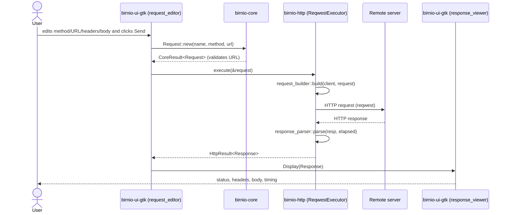
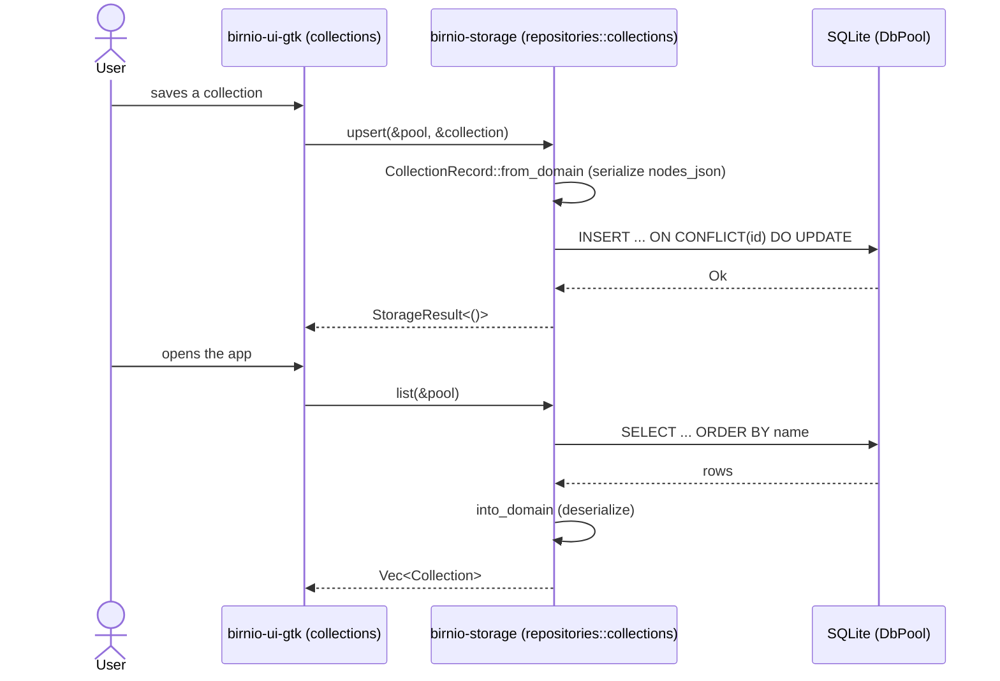

<!-- generated by sdd-docs · derived from birnio-http + birnio-storage @ main · 2026-06-12 -->

# Sequence Diagrams

Birnio's runtime flows. Participants are real crates/modules. The M1 target
("First Request Execution") is the first flow below.

## Send a request and render the response (M1)

Errors: invalid URL → `CoreError::InvalidUrl` (the UI shows a validation error and
does not call `execute`); build failure → `HttpError::RequestBuild`; network
failure → `HttpError::Reqwest`. Both are rendered in the response_viewer as an
error state.

## Persist and reload a collection (current: SQLite)

> When HAR persistence (M2/M3) replaces SQLite, the `DB` participant becomes
> `HAR workspace (files)` and the writer becomes atomic (#19). Update this then.
